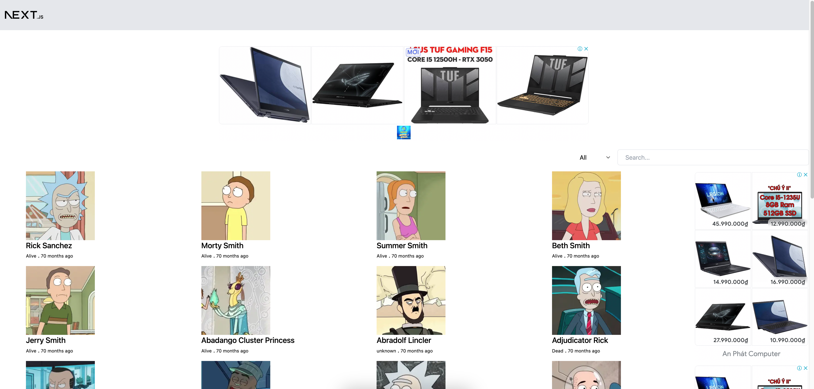

### Next.js - Google Publisher Tag Ads (GPT Ads) Example

This is an example of how to use Google Publisher Tag Ads (GPT Ads) with Next.js.




In this project, I just grab ads from [vnexpress.net](https://vnexpress.net/) website as an example. You can change the ads to your own ads.

### Run locally

Create a `.env` file in the root directory and add this:

```
API_RICK_AND_MORTY=https://rickandmortyapi.com/graphql
```
then run:
```bash
yarn
yarn dev
```
### Reference
- [Google Publisher Tag Ads](https://developers.google.com/publisher-tag/guides/get-started)
- [Google Publisher Tag Ads in Next.js Single Page Application Case Study](https://www.monterail.com/blog/gpt-ads-in-spa-next.js?utm_medium=social&utm_source=facebook&utm_campaign=development)